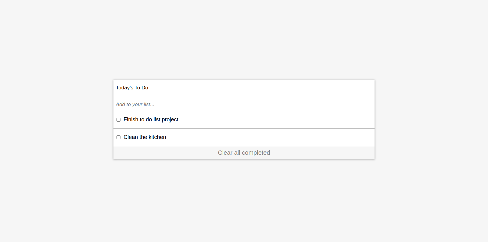

# To-Do-List App
A simple app to add your daily tasks.

You can add and remove tasks or mark tasks that you already did.

# Build With
* HTML 5
* CSS 3
* JS & ECMA 6
* Linters(webhint, stylelint, eslint)

# Get started
1) Open your command
2) Type "git clone https://github.com/ahmed-al-farouq/to-do-list.git"
3) Enjoy!

or

1) Navigate to code tab
2) Click on index.html
3) Enjoy!

# Live Demo
[Live-Dome](https://ahmed-al-farouq.github.io/to-do-list/)

# Prerequisites
You need to know:
* HTML
* CSS
* JS
* Webpack

# Setup
1) Open command line
2) Type "git clone https://github.com/ahmed-al-farouq/to-do-list.git"
3) npm i webpack webpack-cli webpack-dev-server --save-dev
4) npm run start
5) Enjoy!

# Authors
:bearded_person: **Ahmed Omar**
  - Github: [@Ahmed-Alfarouq](https://github.com/ahmed-al-farouq)
  - LinkedIn: [LinkedIn](https://www.linkedin.com/in/ahmed-al-farouq/)
  - Twitter: [@twitter](https://twitter.com/ahmed_al_farouq)

# :handshake: Contributing
Contributions, issues, and feature requests are welcome!
Feel free to check the issues page.

# license
This project is MIT licensed.
